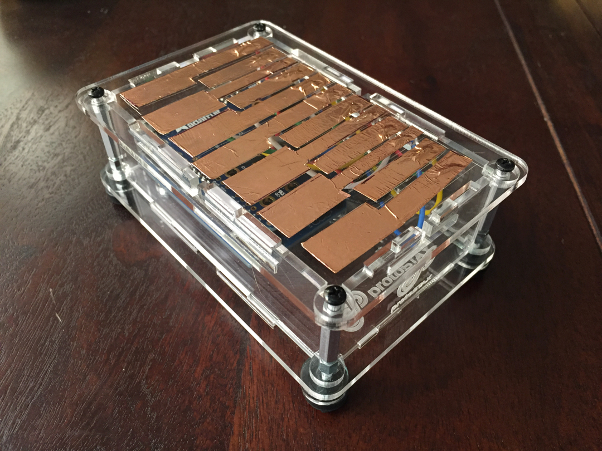

# ProtoStax_CapacitiveTouch_Piano_Demo

Demo for ProtoStax Capacitive Touch Piano with Adafruit 12 x Capacitive Touch Shield for Arduino - MPR121, Piezo Buzzer, Arduino



using [ProtoStax for Arduino](https://www.protostax.com/products/protostax-for-arduino) Enclosure

## Prerequisites

This demo uses
* [Adafruit 12 x Capacitive Touch Shield for Arduino - MPR121](https://www.adafruit.com/product/2024)
* [Piezo Buzzer - PS1240](https://www.adafruit.com/product/160)
* [ProtoStax for Arduino](https://www.protostax.com/products/protostax-for-arduino)
* Arduino (Uno), but you can use other form factors that fit a Shield

For further instructions, see the [Portable Capacitive Touch Piano](https://www.hackster.io/sridhar-rajagopal/protostax-capacitive-touch-piano-demo-2c38e9) Tutorial at [Hackster.io](https://www.hackster.io/sridhar-rajagopal/protostax-capacitive-touch-piano-demo-2c38e9)

Also see
[Multi-Octave Portable Capacitive Touch Piano](https://create.arduino.cc/projecthub/sridhar-rajagopal/multi-octave-portable-capacitive-touch-piano-0ac3e4) Tuturial

## Installing

This demo uses the Adafruit_MPR121 library - see [https://github.com/adafruit/Adafruit_MPR121](https://github.com/adafruit/Adafruit_MPR121)
It also uses the built-in tone library. You can replace it with the NewTone library if you like

```
Arduino IDE->Sketch->Include LIbrary->Manage Libraries - choose
Adafruit_MPR121 and install it
git clone https://github.com/protostax/ProtoStax_CapacitiveTouch_Piano_Demo.git
```

## Usage

See instructions in Tutorial linked above for putting together the shield, parts and 
enclosure. 

```
open
ProtoStax_CapacitiveTouch_Piano_Demo/ProtoStax_CapacitiveTouch_Piano_Demo.ino in
Arduino IDE
compile sketch and upload to your Arduino
```

## License

Written by Sridhar Rajagopal for ProtoStax. BSD license, all text above must be included in any redistribution

A lot of time and effort has gone into providing this and other code. Please support ProtoStax by purchasing products from us!
Also uses the Adafruit MPR121 Shield for Arduino and
Adafruit_MPR121 library. Please support Adafruit by purchasing products from them!


